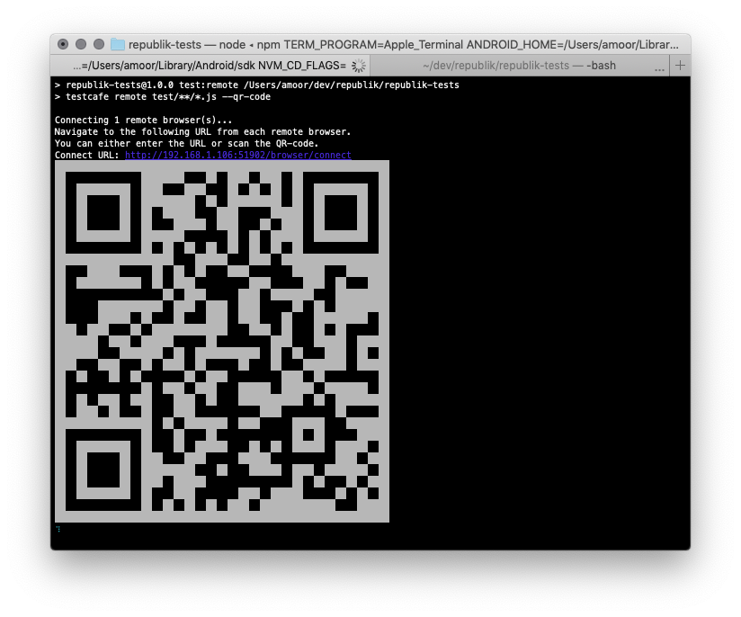

# republik-tests
End-to-end testing of the Republik web presence

## Getting started

  1. Install dependencies  
     `npm install`
 
 2. Run headless Chrome test  
    `TARGET_URL="http://target.url" npm test` (default is `localhost:3010`)

### All platforms

Execute `npm run test:remote` and direct the browser manually to the address displayed



### Platform-specific tests

#### Mac

    npm run test:mac

#### Windows

    npm run test:win

### iOS simulator

    npm run test:ios

### Android emulator

1. Start Android emulator

2. `npm run test:android`

## Writing tests

Run the [sample](sample) in Chrome: `npm run test:sample`

## Running on Travis

The install script tries to fetch branches of the frontend and backend according to following logic: 

- `FRONTEND_BRANCH || TRAVIS_BRANCH || 'master'`
- `BACKENDS_BRANCH || TRAVIS_BRANCH || 'master'`

If a branch is not available in a repo it will log it and use `master` instead. You can trigger a custom build on [travis-ci.com](https://travis-ci.com/orbiting/republik-tests) via more options and provide the branches with an custom config:

```
env: FRONTEND_BRANCH=serie2 BACKENDS_BRANCH=serie2
```
